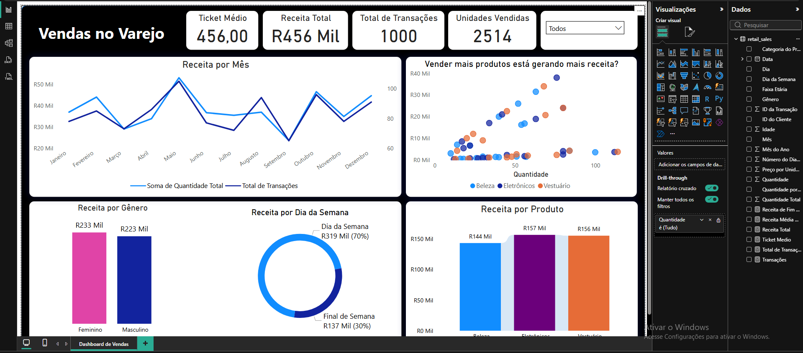

# 📊 Dashboard Analítico de Vendas no Varejo

> Repositório oficial do projeto de extensão focado na aplicação de **Estatística Descritiva** e *Business Intelligence* (BI) para otimizar a análise de desempenho e a tomada de decisão no setor varejista. Este trabalho traduz conceitos da Estatística Aplicada em uma ferramenta de gestão estratégica.

## ✨ Demonstração Visual

O dashboard transforma dados brutos de transações em **KPIs estratégicos** (Indicadores Chave de Desempenho) visuais.

## 🗂️ Arquivos
- `retail_sales.pbix` - Arquivo do Power BI
- `retail_sales.csv` - Dados utilizados no dashboard

## 🚀 Como Usar
1. Abra o `retail_sales.pbix` no Power BI Desktop
2. Conecte com o `retail_sales.csv` se necessário

## ⚙️ Tecnologias e Dependências

| Item | Descrição |
| :--- | :--- |
| **Ferramenta de BI** | Power BI Desktop (`.pbix` file). |
| **Linguagens** | **DAX** (Data Analysis Expressions) e **M** (Linguagem Power Query). |
| **Fonte de Dados** | **retail_sales.csv** |

## 🎯 Objetivo e Aplicação (Contexto de Extensão)

Este projeto foi desenvolvido com o propósito de extensão acadêmica, visando capacitar **Gestores e Proprietários de PMEs do Varejo** a tomar decisões baseadas em evidências quantitativas. A ferramenta foi projetada para ser uma solução de baixo custo para análise de dados.

* **Principal Valor Analítico:** Fornecer uma análise rápida da **Média de Vendas (Ticket Médio)**, **Sazonalidade (Série Temporal)** e **Distribuição de Frequência** (por produto e gênero).
* **Público:** Pequenos e Médios Empreendedores e profissionais de análise do Varejo.
* **Local de Aplicação:** Disponibilização via **Ambiente Digital** (GitHub) para acesso e implementação autônoma.

## 💡 Análise Estatística no Dashboard

A documentação enfatiza o valor estatístico de cada visualização, ligando a teoria à prática de negócios.

| Visualização | Conceito Estatístico Principal | Insight Estratégico |
| :--- | :--- | :--- |
| **Ticket Médio** | **Média Aritmética (Tendência Central)** | Define o *benchmark* do gasto médio por cliente (`$456,00`), crucial para medir a eficácia das estratégias de *upselling* e **monitorar a variabilidade** da despesa. |
| **Receita por Mês** | **Série Temporal e Sazonalidade** | Permite a identificação de picos de venda, auxiliando no planejamento de estoque e *marketing* alinhado à **tendência** anual. |
| **Vender mais produtos...** | **Diagrama de Dispersão e Correlação Visual** | Explora a **correlação** entre a **Quantidade Vendida** e a **Receita**, permitindo avaliar a eficiência dos produtos e o foco em itens de alto valor. |
| **Receita por Dia/Gênero** | **Distribuição de Frequência Relativa** | Mostra a **concentração da receita** em categorias específicas (ex: 70% nos dias da semana), informando a alocação otimizada de recursos. |

## 📝 Estrutura e Métricas Chave (Preenchimento Técnico Obrigatório)

Esta seção documenta as fórmulas exatas que sustentam o dashboard (medidas DAX), essenciais para qualquer repositório de BI.

| Métrica | Fórmula DAX | Notas de Tratamento (Power Query - M) |
| :--- | :--- | :--- |
| **Ticket Médio** | `[Ticket Medio = DIVIDE( [Receita Total], [Total de Transações] )]` | **[Garantia de que a coluna de valor é numérica e tratamento de erros.]** |
| **Receita Total** | `Receita Total = SUM ( 'retail_sales'[Quantidade Total] )` | **[Garantia de que a coluna de valor é numérica e tratamento de erros.]** |
| **Total de Transações** | `Total de Transações = COUNTROWS('retail_sales')` | **[Confirmação do tipo de dados.]** |
| **Unidades Vendidas** | `Quantidade = SUM ('retail_sales'[Quantidade])` | **[Confirmação do tipo de dados.]** |

## 🚀 Como Executar o Projeto

1.  Certifique-se de ter o **Power BI Desktop** instalado.
2.  Clone este repositório ou baixe o arquivo `retail_sales.pbix`.
3.  Abra o arquivo no Power BI Desktop.
4.  Se necessário, atualize a fonte de dados na seção "Transformar Dados" (Power Query) para o seu ambiente local.